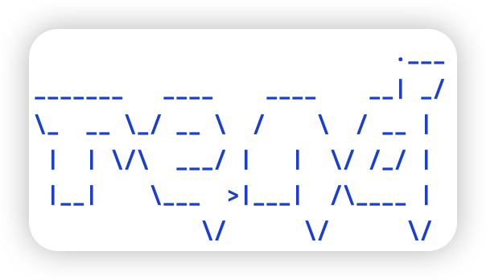
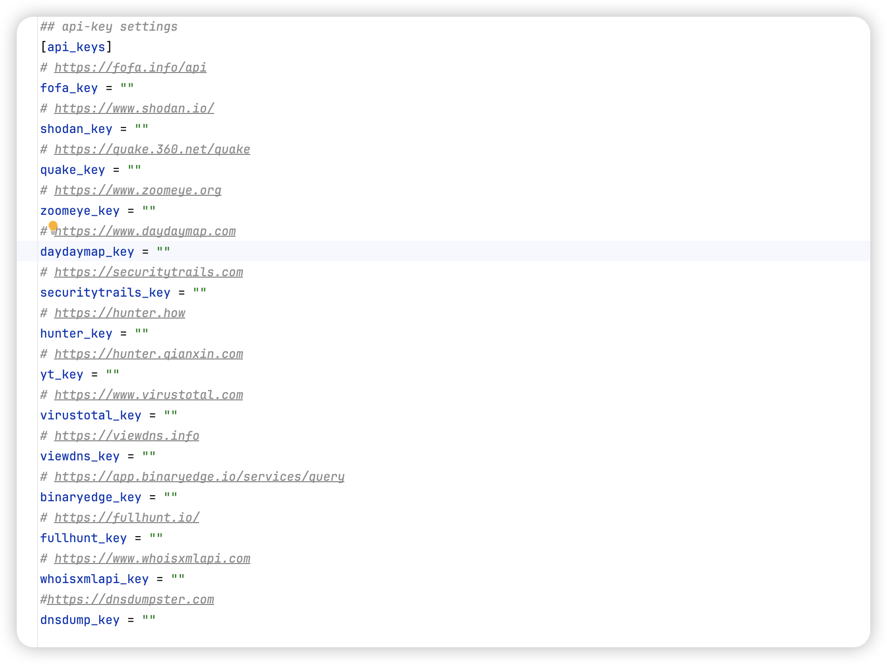
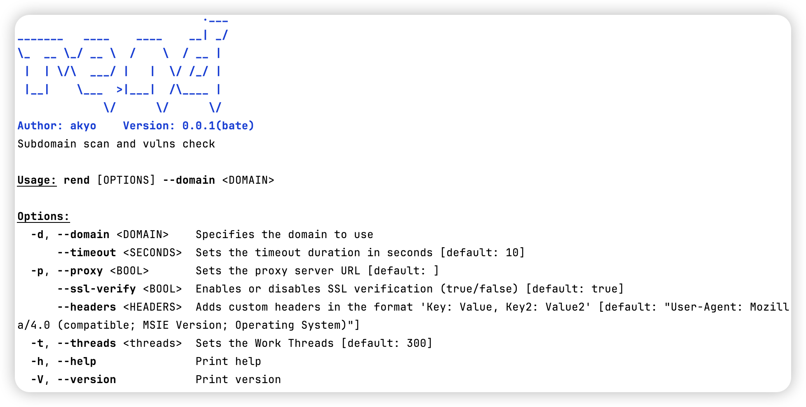

# Rend

## 📅 2024-12-04

**rend是一款前期快速打点，薄弱点扫描工具**

## 🔥 功能

- **整合多个搜索引擎进行资产收集**
- **内置finger指纹库进行指纹识别**
- **各类厂商Key值检测**
- **自动Fuzz404**
- **内置简单漏洞检测机制，遇到带参链接自动替换，进行以下检测**
  - **SQL**
  - **RCE**
  - **SSRF**
  - **FILE READ**
- **对IP结果进行简单cdn判断并执行端口收集，将结果传入指纹漏洞识别**
- **各类结果进行文件保存**

**支持引擎如下:**

|    搜索引擎    | 支持 | 是否需要API |
| :------------: | :--: | :---------: |
|   daydaymap    |  ✅   |      ✅      |
|   hunter.how   |  ✅   |      ✅      |
|    Chaziyu     |  ✅   |      ❌      |
|     crt.sh     |  ✅   |      ❌      |
|  whoisxmlapi   |  ✅   |      ✅      |
|   binaryedge   |  ✅   |      ✅      |
|     quake      |  ✅   |      ✅      |
|      鹰图      |  ✅   |      ✅      |
|    zoomeye     |  ✅   |      ✅      |
|    Rapiddns    |  ✅   |      ❌      |
|  Sitedossier   |  ✅   |      ❌      |
|    jldc.me     |  ✅   |      ❌      |
|    ViewDNS     |  ✅   |      ✅      |
|     C99NL      |  ✅   |      ❌      |
|   Alienvault   |  ✅   |      ❌      |
|   Dnshistory   |  ✅   |      ❌      |
|  Hackertarget  |  ✅   |      ❌      |
|  Certspotter   |  ✅   |      ❌      |
|    Fullhunt    |  ✅   |      ✅      |
|      fofa      |  ✅   |      ✅      |
|  dnsdumpster   |  ✅   |      ✅      |
|   virustotal   |  ✅   |      ✅      |
|     shodan     |  ✅   |      ✅      |
|     Netlas     |  ✅   |      ❌      |
| Securitytrails |  ✅   |      ✅      |
|     censys     |  ❌   |      ✅      |

## 💻 安装

~~~shell
git clone https://github.com/akyosk/rend.git
~~~

## ⚙️ 编译前配置

**config.toml位于config目录下**

## 🎉 编译

~~~shell
cd rend && cargo --build
~~~

**注：编译文件处与target/debug目录下**

## ⚡️ 使用

~~~shell
./rend -h或--help
~~~

## 🌍 作者杂谈

**第一次学习Rust，并使用Rust写下了这个工具，很多东西还不是很清楚，后续慢慢改进，不喜轻喷**😝

